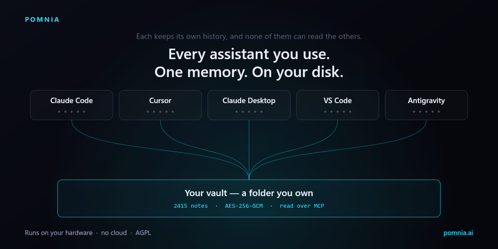

# Pomnia



**One encrypted memory your AI agents share** — conversations from every assistant, distilled on your own hardware, recalled over MCP. Local-first: nothing depends on a vendor's cloud.

Pomnia Desktop (Windows / macOS) collects chats from assistants (Claude Code, Cursor, Claude Desktop, Antigravity, VS Code, Continue) **and** imports from exports (Claude.ai, ChatGPT, Gemini, Grok) plus documents (PDF, DOCX, EPUB) into one vault — with search (**Chats**), distill via Ollama, and Brain on `127.0.0.1:7862`.

I have run this on my own machines for six months, every working day — 2415 distilled
notes and 3735 indexed chunks at the time of writing. It went public about seven weeks
ago. That is a real test and a narrow one, and the docs say which parts are which.

> **Desktop app** — version in [`package.json`](package.json). Windows installer: **only** via `npm run release:win` (see below). Start: [docs/START-HERE.md](docs/START-HERE.md).  
> **Repo:** [github.com/lobrzut/pomnia](https://github.com/lobrzut/pomnia) · **Site:** [pomnia.ai](https://pomnia.ai)

---

## Why

Every assistant keeps conversations somewhere else. Switch machines and you lose context. Pomnia:

- **extracts** conversations into one model (`Conversation` / `Message`),
- **protects** chats + configs in a content-addressed, encrypted **vault folder** (e.g. `C:\Vault` — any name works, including `*.pomnia`),
- **moves** the safe — copy the whole vault folder to another PC → Open vault → password,
- **feeds Brain** — distill → notes + index, then MCP for Cursor / other agents.

## Simple flow (Desktop)

1. **Start Brain** — Brain tab → start embedded Brain (needs [Ollama](https://ollama.com): `nomic-embed-text` + a distill model; `llama3.1:8b` is the measured default — it scored higher than `qwen2.5:14b` and ran about twice as fast).
2. **Backup and into Brain** — Dashboard: backup sources → distill into local Brain.
3. **Connect MCP** — Connect tab → snippet for `http://127.0.0.1:7862` → paste into Cursor (`Settings → MCP`) → Reload.

Optional: **Handshake** — personal start ritual in the UI; not required for the product to work.

**Advanced:** remote Brain / homelab KVM (other host `:7862`, Bearer, auto-deploy) — [docs/START-HERE.md](docs/START-HERE.md), [docs/BRAIN-KVM-ARCHITECTURE.md](docs/BRAIN-KVM-ARCHITECTURE.md), [docs/BRAIN-INTEGRATION.md](docs/BRAIN-INTEGRATION.md).

## Sources

| Source | Strategy | From | What |
|---|---|---|---|
| **Claude Code** | hybrid | `~/.claude` | JSONL → conversations **+** snapshot of `projects/`, `sessions/`, `settings.json` |
| **Cursor** | hybrid | `…/Cursor/User` | chats from `globalStorage/state.vscdb` **+** config snapshot |
| **Claude Desktop** | snapshot | `%APPDATA%/Claude` / `~/Library/Application Support/Claude` | config, local sessions, Local Storage |
| **Antigravity** | hybrid | `%APPDATA%/Antigravity` · chats in `~/.gemini/antigravity` | Cascade transcripts **+** profile snapshot |
| **VS Code** / **Windsurf** | snapshot | `…/Code/User` · `…/Windsurf/User` | settings, snippets, `globalStorage` |
| **Continue** | snapshot | `~/.continue` | config, sessions, assistants |

Caches (GPUCache, blob_storage, Crashpad, …) are skipped automatically.

## Architecture

```
src/core/            Engine — pure TS, Node + sql.js(WASM) + crypto
  vault.ts           Encrypted, content-addressed store (AES-256-GCM + scrypt)
  adapters/          claudeCode · cursor · profile(snapshot)
  backup.ts          Backup orchestration
  brain/             Distill · localIndex · deploy (Ollama)
packages/brain-core/ Embedded Brain (MCP :7862) bundled with Desktop
src/cli/             Headless CLI
src/main/            Electron + IPC
src/preload/         contextBridge → window.pomnia
src/renderer/        UI: React + Tailwind + Framer Motion
```

## Desktop user guide

> [docs/START-HERE.md](docs/START-HERE.md) · historical audit snapshot: [docs/AUDYT-POMNIA-2026-07-09.md](docs/AUDYT-POMNIA-2026-07-09.md)

**In the app:** encrypted vault, adapter backup, ZIP/JSON + PDF/DOCX/EPUB import, embedded brain-core (MCP `:7862`), distill via Ollama, **How it works** / **Connect** tabs, tray + diagnostics in Settings.

### Session continuation (MCP)

MCP client key is **`pomnia`**. Agent phrases: *check Pomnia* / *save to Pomnia* (PL: *sprawdź w Pomnia* / *zapisz do Pomnia*).

- **Auto-checkpoint** (Settings, default ON) — the agent can write a milestone via `checkpoint_session` without a user phrase (decision, fix+path, error+command, architecture) → `vault/sessions/checkpoints/`.
- **“Save to Pomnia” / “zapisz do Pomnia”** — conscious full commit → `save_conversation` → `vault/sessions/`.

Agent rules include **PRIORITY** session-start (`get_user_profile` + search) and Handshake proof that MCP `pomnia` is wired.

### Incremental index

**Refresh index** / `indexDir` skips unchanged files (mtime+size, then content-hash) — no re-embed. Distill indexes only new notes via `indexFiles` (source of truth: `library.db`).

### Thin OCR (scanned PDFs)

On Import: when the text layer is sparse → **Run OCR** (`tesseract.js`, eng+pol; max ~3 sparse pages). **No scribe.js** (AGPL). Tessdata in `resources/tessdata` (`npm run stage:tessdata`).

**Common issues:**

| Symptom | What to do |
|-------|-----------|
| Distill won’t start | Ollama offline or missing distill model — Brain → Pull model |
| No Brain results | Missing `nomic-embed-text` |
| Cursor “Not connected” | Snippet from Connect; restart Cursor |
| Cursor 0 chats after backup | Large `state.vscdb` — use **Import** instead of live backup |
| SmartScreen / Gatekeeper | Unsigned open-source build — “Run anyway” / Gatekeeper bypass (expected) |
| Symantec / Defender on unsigned build | **Do not turn off AV.** Trusting the file once / SmartScreen override is normal for a new hash. Authenticode removes this long-term: [docs/CODE-SIGNING.md](docs/CODE-SIGNING.md). Folder exclusions only if AV keeps quarantining (Settings → Windows / antivirus) |
| Installer “cannot be closed” | Tray → **Quit**, close setup, try again (NSIS closes `Pomnia.exe`) |

### Windows AV — unsigned builds will warn

**Today (unsigned):** SmartScreen and some AVs warn on each new `setup.exe` hash. That is reputation, not a signal to disable protection. “Run anyway” / “I trust this file” once is expected.

**Goal:** Authenticode (OV/EV or Azure Trusted Signing) so Windows installs are quiet — details: [docs/CODE-SIGNING.md](docs/CODE-SIGNING.md). Exclusions ≠ product strategy; use only if AV repeatedly quarantines the install folder or vault (in-app: **Settings → Windows / antivirus**).

Unsigned builds can trip heuristics (Electron + vault I/O). Never disable AV.

**Installers** — Windows: **`npm run release:win` is the only allowed path** to a shippable `.exe` (clean tree → build `brain-core` + `doc-parser` → typecheck → tests → patch bump + `Release X.Y.Z` commit → `build:win` with injected build identity). Do not bump version by hand and run `pack:win` / `build:win` alone for a release. Mac: `npm run pack:mac` (local). Releases: [GitHub Releases](https://github.com/lobrzut/pomnia/releases).

Logs: `%AppData%/Pomnia/logs/` (Windows).

---

## Run (dev)

```bash
npm ci
npm run generate:build-info   # writes src/buildInfo.ts (version · git sha · timestamp)
npm run dev          # Electron + hot reload (regenerates buildInfo first)
npm test             # vitest
npm run build        # bundle → out/ (regenerates buildInfo)
npm run release:win  # ONLY path to Windows installer (see above)
npm run build:win    # pack only — used by release:win after the Release commit
npm run pack:mac     # DMG / macOS app
```

Use **`npm ci`** on a fresh clone (installs from the lockfile; does not rewrite it). Prefer `npm ci` over `npm install` so `package-lock.json` stays the source of truth across machines and npm versions.

Build identity (Settings → Security, and `pomnia --version`): `0.1.45 · 7ff41c7 · 2026-07-30 01:12` — dirty tree at generate time appends `+dirty` to the sha.

### Windows: never run vitest from a UNC path

If the repo is opened over SMB (`\\server\share\…`), `npm test` / `vitest` can start under `C:\Windows` and **exit 0 without running any tests** (silent failure). Always run install/tests from a **local disk mirror**, e.g. `C:\Users\<you>\pomnia-build-*` (robocopy/sync from the share, then `npm ci` + `npx vitest run …` there).

### CLI (no GUI)

```bash
npm run cli scan
npm run cli doctor
npm run cli doctor -- --json
POMNIA_PASS=… npm run cli backup --vault ~/Pomnia.pomnia --create --sources all
npm run cli list    --vault ~/Pomnia.pomnia
npm run cli verify  --vault ~/Pomnia.pomnia
npm run cli brain-export --out ~/brain-notes --sources all
```

`pomnia doctor` exits **0** when there are no FAILs (WARN-only is OK), **1** if any check is FAIL. `--json` prints the structured report.

## Brain — embedded (default) and remote

**Default:** Brain runs *inside* Pomnia Desktop on `127.0.0.1:7862` (distill + embed + MCP on this machine).

```
Collect/Import → Distill (Ollama) → Index → MCP (:7862)
```

- **Import** — Claude.ai / ChatGPT / Grok / Gemini exports (ZIP/JSON), PDF/DOCX/EPUB documents.
- **Distill** — conversation → note (Summary / Decisions / …).
- **Index** — local embeddings → semantic search.
- **Connect** — MCP snippet for Cursor.

CLI (optional):

```bash
POMNIA_OLLAMA=http://localhost:11434 npm run cli brain status
npm run cli brain pipeline --out ~/brain-notes --sources all
npm run cli brain search   --notes ~/brain-notes "…"
```

Remote / KVM = advanced mode (your own Brain server on the LAN) — see docs above.

## Security

Rules: [SECURITY.md](SECURITY.md).

- AES-256-GCM, random IV per blob, integrity tag — for vault **conversation/document blobs**.
- scrypt (N=2¹⁷) from passphrase; passphrase never stored.
- Vault header: salt + check token — no secrets.
- `verify` walks every blob and checks hashes.
- **Honesty:** vault sidecars (`skills/`, `USER.md`, `sessions/`, distilled notes) and Brain’s on-disk index (`library.db`) are **plaintext** — protect those folders ([docs/START-HERE.md](docs/START-HERE.md)).
- **No telemetry by default.** Windows installers may be unsigned; SmartScreen warnings are expected until Authenticode ([docs/CODE-SIGNING.md](docs/CODE-SIGNING.md)).

## Roadmap

- [x] Embedded Brain (MCP `:7862`) + local distill in Desktop
- [x] Conversation browser (**Chats**) — full-text without GPU
- [x] Brain pipeline Collect→Distill→Index (CLI + GUI)
- [ ] Map-reduce for very long conversations
- [ ] Incremental backup by mtime
- [ ] Vault sync (git-remote / S3 / WebDAV)
- [ ] Backup schedules (CLI + Task Scheduler / launchd)
- [ ] Signed installers
- [ ] Linux AppImage/deb via CI ([docs/LINUX-BUILD.md](docs/LINUX-BUILD.md)) — configure shipped; premiere artifact from `ubuntu-latest`

---

## License

**GNU AGPL-3.0-only** — full text in [LICENSE](LICENSE).

Copyright © 2026 Pomnia

You may use, study, modify, and redistribute. One condition matters: if you distribute a modified version **or make it available to others over a network as a service**, you must give recipients its source code under the same license (§13 — *Remote Network Interaction*).

AGPL does not forbid making money. It forbids making money on a closed fork of someone else’s work — that is a different thing.

**Commercial license.** Copyright in the whole work belongs to a single author, so if AGPL does not fit your model (e.g. you want to embed Pomnia in a closed product), we can negotiate separately: [hello@pomnia.ai](mailto:hello@pomnia.ai)

---

## Trademark

The name **Pomnia** and the logo are **not** covered by the AGPL. You may fork the code and do with it what the license allows — but the version you distribute must not be called “Pomnia” or suggest it comes from the original author. Name your fork something else.

The reason is simple: code can be audited; a name has to be trusted. This rule protects people who download something believing it is the original.

Pomnia is not a registered trademark; this section reserves the name rather than asserting registration. It is enforceable on the same basis as any unregistered sign — through use, and through the fact that the licence itself grants no rights to the name.

---

Pomnia · [pomnia.ai](https://pomnia.ai) · [github.com/lobrzut/pomnia](https://github.com/lobrzut/pomnia)
