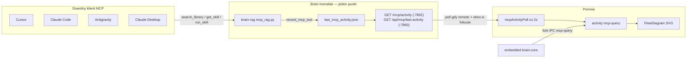

# FlowDiagram na żywo — jeden punkt obserwacji (Brain MCP)

**Nie trzeba per agenta.** Cursor, Claude Code, Claude Desktop, Antigravity, Windsurf — każdy klient MCP woła ten sam serwer `brain-rag`. Pomnia obserwuje **wyłącznie Brain**, nie pliki konfiguracyjne agentów.

## Architektura



## Co się dzieje przy zapytaniu

1. Agent woła narzędzie MCP (`search_library`, `get_skill`, `run_skill`, …).
2. `dashboard/mcp_rag.py` → `record_mcp_tool()` zapisuje `{ tool, ts, query_preview }` do `data/last_mcp_activity.json`.
3. Pomnia:
   - **Embedded** (`brainTarget=embedded`): child process `brain-core` emituje `mcp-query` przez fork IPC — bez pollingu.
   - **Remote** (`brainTarget=remote`): main process polluje co **2 s** gdy okno w fokusie i widoczny jest Dashboard lub HowItWorks (`mcpActivity:watch` ref-count).
4. `activity.update({ kind: 'mcp-query' })` → FlowDiagram podświetla gałąź agent → biblioteka.

## Endpointy (Brain)

| URL | Port | Format |
|-----|------|--------|
| `GET /mcp/activity` | 7862 (auth proxy) | `{ last: { tool, detail, ts }, recent }` |
| `GET /api/mcp/last-activity` | 7860 (dashboard) | `{ tool, ts, query_preview }` |
| `GET /api/mcp/last-activity` | 7862 (alias) | j.w. |

`recent=true` gdy ostatnie wywołanie &lt; 4 s temu. Tylko metadane — bez treści vaultu.

## Deploy Brain (homelab / brain.example.local)

Na serwerze Brain (repo `brain`, branch `main` → remote `hub`):

```powershell
cd C:\Users\Alice\Projects\brain   # lub SSH na 201

# 1. Pull + upewnij się że jest pipeline/mcp_activity.py
git pull hub main

# 2. Restart usług MCP (supergateway + auth proxy + mcp_rag)
# Docker:
docker compose restart brain-mcp-gateway brain-mcp-auth-proxy

# Lub systemd (Linux):
sudo systemctl restart brain-mcp-gateway brain-mcp-auth-proxy

# 3. Restart dashboardu FastAPI (:7860) — nowy endpoint /api/mcp/last-activity
sudo systemctl restart brain-dashboard
# lub: docker compose restart brain-dashboard
```

**Smoke test:**

```powershell
curl -s http://brain.example.local:7862/mcp/activity
curl -s http://brain.example.local:7860/api/mcp/last-activity
```

W Cursorze: `brain-rag.search_library "test"` — w ciągu 2 s FlowDiagram w Pomni powinien mrugnąć gałęzią MCP.

## Konfiguracja Pomnia

1. Ustawienia → Brain target: **Remote**
2. URL MCP: `http://brain.example.local:7862` (auth proxy)
3. Token MCP (ten sam co w `~/.cursor/mcp.json`)
4. Otwórz **Dashboard** lub **Jak to działa** — polling włącza się automatycznie

## Czego NIE robimy

- ❌ Hooki w Cursor / Claude / Antigravity
- ❌ Parsowanie logów agentów
- ❌ Osobna integracja per klient

Wystarczy skonfigurować klienta na Brain MCP (Connect → snippet) — diagram żyje sam.
