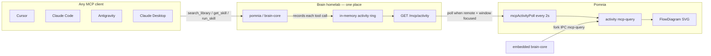

# Live FlowDiagram — one place to watch (Brain MCP)

**No per-agent work needed.** Cursor, Claude Code, Claude Desktop, Antigravity, Windsurf — every MCP client calls the same `pomnia` server (the legacy `brain-rag` key still works). Pomnia watches **Brain only**, never the agents' own config files.

## Architecture



## What happens on a query

1. The agent calls an MCP tool (`search_library`, `get_skill`, `run_skill`, …).
2. brain-core records `{ tool, ts, query_preview }` and serves the most recent call from `GET /mcp/activity`.
3. Pomnia:
   - **Embedded** (`brainTarget=embedded`): the `brain-core` child process emits `mcp-query` over fork IPC — no polling at all.
   - **Remote** (`brainTarget=remote`): the main process polls every **2 s** while the window has focus and either Dashboard or HowItWorks is visible (`mcpActivity:watch` ref-count).
4. `activity.update({ kind: 'mcp-query' })` → FlowDiagram lights the agent → library branch.

## Endpoint

| URL | Shape |
|-----|--------|
| `GET /mcp/activity` | `{ last: { tool, detail, ts }, recent }` |

Served by brain-core on its own port — `7862` for the brain embedded in Pomnia Desktop, whatever the appliance is configured with otherwise (`7865` on the reference deployment). `recent=true` when the last call was less than 4 s ago. Metadata only — no vault content leaves the server.

> Older revisions of this page described a Python hub: `dashboard/mcp_rag.py` writing `data/last_mcp_activity.json`, a FastAPI dashboard on `:7860`, and `supergateway` plus an auth proxy in front. All of it is gone. brain-core is one Node process that answers MCP, admin and health on a single port, and none of those services or endpoints exist to restart.

## Deploying Brain (homelab)

brain-core runs as one container. On the appliance:

```bash
# compose.yaml pins the image tag; bump it and bring the service up
sed -i s@brain-core:OLD@brain-core:NEW@ compose.yaml
docker compose up -d
sleep 15
curl -s http://127.0.0.1:7865/healthz
```

`/healthz` must report the version you just deployed and `"status":"ok"`. Keep the previous `compose.yaml` so a bad start can be rolled back without reconstructing it by hand.

**Smoke test:**

```bash
curl -s http://brain.example.local:7865/mcp/activity
```

In Cursor: `pomnia.search_library "test"` — within 2 s the FlowDiagram in Pomnia should blink its MCP branch.

## Pomnia configuration

1. Settings → Brain target: **Remote**
2. MCP URL: `http://brain.example.local:7865` — the host and port only. Pomnia strips a trailing `/admin`, `/mcp` or `/status` if you paste the address bar from the admin panel, and probes the endpoint before writing any client config.
3. MCP token (the same one as in `~/.cursor/mcp.json`)
4. Open **Dashboard** or **How it works** — polling starts on its own

## What we deliberately do not do

- ❌ Hooks in Cursor / Claude / Antigravity
- ❌ Parsing agent logs
- ❌ A separate integration per client

Point the client at Brain MCP (Connect → snippet) and the diagram takes care of itself.
