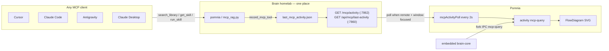

# Live FlowDiagram — one place to watch (Brain MCP)

**No per-agent work needed.** Cursor, Claude Code, Claude Desktop, Antigravity, Windsurf — every MCP client calls the same `pomnia` server (the legacy `brain-rag` key still works). Pomnia watches **Brain only**, never the agents' own config files.

## Architecture



## What happens on a query

1. The agent calls an MCP tool (`search_library`, `get_skill`, `run_skill`, …).
2. `dashboard/mcp_rag.py` → `record_mcp_tool()` writes `{ tool, ts, query_preview }` to `data/last_mcp_activity.json`.
3. Pomnia:
   - **Embedded** (`brainTarget=embedded`): the `brain-core` child process emits `mcp-query` over fork IPC — no polling at all.
   - **Remote** (`brainTarget=remote`): the main process polls every **2 s** while the window has focus and either Dashboard or HowItWorks is visible (`mcpActivity:watch` ref-count).
4. `activity.update({ kind: 'mcp-query' })` → FlowDiagram lights the agent → library branch.

## Endpoints (Brain)

| URL | Port | Shape |
|-----|------|--------|
| `GET /mcp/activity` | 7862 (auth proxy) | `{ last: { tool, detail, ts }, recent }` |
| `GET /api/mcp/last-activity` | 7860 (dashboard) | `{ tool, ts, query_preview }` |
| `GET /api/mcp/last-activity` | 7862 (alias) | as above |

`recent=true` when the last call was less than 4 s ago. Metadata only — no vault content leaves the server.

## Deploying Brain (homelab / 192.168.x.x)

On the Brain server (repo `brain`, branch `main` → remote `hub`):

```powershell
cd C:\Users\Alice\Projects\brain   # or SSH to the host

# 1. Pull, and make sure pipeline/mcp_activity.py is present
git pull hub main

# 2. Restart the MCP services (supergateway + auth proxy + mcp_rag)
# Docker:
docker compose restart brain-mcp-gateway brain-mcp-auth-proxy

# Or systemd (Linux):
sudo systemctl restart brain-mcp-gateway brain-mcp-auth-proxy

# 3. Restart the FastAPI dashboard (:7860) — it serves the new
#    /api/mcp/last-activity endpoint
sudo systemctl restart brain-dashboard
# or: docker compose restart brain-dashboard
```

**Smoke test:**

```powershell
curl -s http://brain.example.local:7862/mcp/activity
curl -s http://brain.example.local:7860/api/mcp/last-activity
```

In Cursor: `pomnia.search_library "test"` — within 2 s the FlowDiagram in Pomnia should blink its MCP branch.

## Pomnia configuration

1. Settings → Brain target: **Remote**
2. MCP URL: `http://brain.example.local:7862` (auth proxy)
3. MCP token (the same one as in `~/.cursor/mcp.json`)
4. Open **Dashboard** or **How it works** — polling starts on its own

## What we deliberately do not do

- ❌ Hooks in Cursor / Claude / Antigravity
- ❌ Parsing agent logs
- ❌ A separate integration per client

Point the client at Brain MCP (Connect → snippet) and the diagram takes care of itself.
